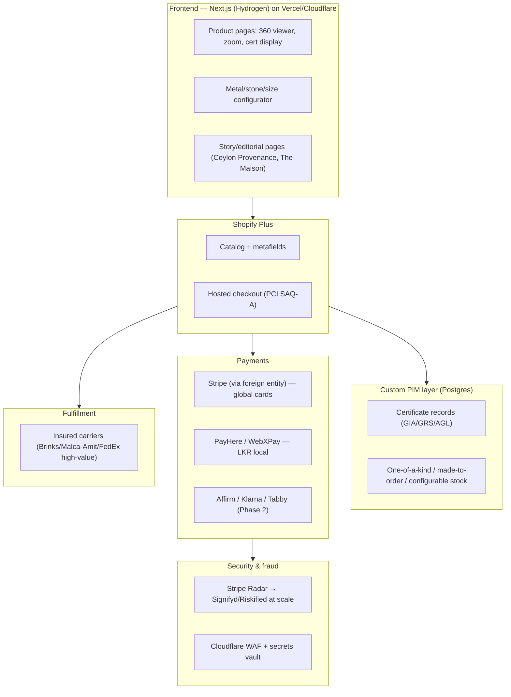

# Technical Architecture

## Commerce platform — Shopify Plus + Hydrogen now, composable later

For a business at SME scale today that needs "big brand" polish fast, **Shopify Plus + Hydrogen (Next.js-based storefront)** is the strongest starting point: weeks-not-quarters time-to-market, a large luxury-agency talent pool to draw on, and PCI scope handled mostly by Shopify's own checkout.

The real constraint: Shopify caps products at **3 options / 100 variants**, which is a genuine problem for metal × stone × size configurability on made-to-order pieces. Mitigate with a companion PIM (below) driving Shopify metafields and a custom configurator UI, rather than trying to model every combination as a raw variant.

**commercetools** or **Saleor** offer true composable, unlimited data modeling — ideal for certification-heavy jewellery data — but need a real in-house engineering team, 6–12+ month build timelines, and six-figure annual run-rates. This is the right move once the business outgrows Shopify's guardrails, not a day-one choice. **Medusa.js** (open-source Node/TS) is worth prototyping if the team is JS-first and wants full control, but treat it as a 12–18 month investment where you own uptime, ops, and PCI scope yourself — not a launch shortcut. Salesforce Commerce Cloud is cost-prohibitive pre-scale; BigCommerce Enterprise is a reasonable middle ground but has a thinner luxury-frontend ecosystem than Shopify.

## Frontend

**Next.js (App Router)** is the standard top agencies use for luxury DTC: SSR for SEO-critical product/collection pages, ISR for catalog pages, streaming/RSC for perceived speed under heavy imagery. Pair with **Cloudinary or imgix** via a custom `next/image` loader rather than relying solely on Shopify's CDN — this buys on-the-fly art direction, AVIF/WebP negotiation, and a real DAM for ongoing collection photography.

Performance discipline for Core Web Vitals given how image-heavy this category is: lower quality (q50–65) on grid thumbnails, higher (q75–90) on hero/zoom images, preload the LCP hero image, defer 360°/3D viewer scripts until interaction. Host on Vercel (native Next.js fit) or Cloudflare/AWS if data residency becomes a concern at scale.

## Payments & checkout — Sri Lanka + global

This is the hardest architectural problem in the whole build. **Stripe, Adyen, and PayPal/Braintree do not onboard Sri Lanka-domiciled merchant entities directly** — Sri Lanka isn't on their supported-country lists. The standard, well-trodden workaround used by Sri Lankan exporters generally: incorporate a holding/subsidiary entity in a supported jurisdiction (a US LLC via Stripe Atlas, a UK Ltd, Singapore, or a UAE free zone) to hold the international merchant account, while the Sri Lankan entity continues to handle manufacturing and fulfillment. This is routine, not a workaround to be nervous about — but it is a real legal/accounting step that needs a lawyer and accountant, not just a dev team.

- **Global rail**: Stripe (via the foreign entity) — Radar for fraud, hosted Checkout/Elements to keep PCI scope at SAQ-A, multi-currency settlement.
- **Local rail**: **PayHere** or **WebXPay** (both CBSL-approved; WebXPay has the larger merchant base) for LKR/local-card traffic, kept as a separate checkout path rather than forced through the foreign entity.
- **Multi-currency pricing**: price natively in USD/EUR/GBP/AED with market-based (not pure PPP) localization — luxury brands deliberately price higher in strong markets rather than doing a flat FX conversion. Shopify Markets handles this natively if staying Shopify-based.
- **Financing** (Phase 2, not MVP): Affirm for US/Canada, Klarna for broader reach, Tabby/Tamara for a later Gulf expansion (both already serve gold/jewellery merchants in Saudi/UAE).
- **PCI**: hosted fields/redirect checkout everywhere so raw card data never touches your servers — keeps you at SAQ-A, essential with no in-house payments-compliance team.

## Security & fraud

Start with **Stripe Radar**; add **Signifyd** or **Riskified** once volume justifies their ~0.5–1.5% GMV fee — both provide chargeback-liability guarantees, which matters when a single fraudulent order can be $5,000–$50,000. Enforce 3D Secure/SCA on high-risk transactions beyond just the EU-mandated cases, given the ticket size. Baseline platform security: Cloudflare WAF at the edge, secrets in a managed vault (AWS Secrets Manager/Vault) with rotation, tighter rate limits on auth/checkout endpoints, encryption in transit and at rest.

For fulfillment: shipments above roughly $25,000–50,000 need specialist insured carriers (Brinks, Malca-Amit) or FedEx/UPS with declared-value coverage and mandatory signature — standard carrier liability caps (UPS caps precious-metal/gem loss at $1,000 regardless of declared value) make this non-negotiable rather than a nice-to-have.

## Inventory / PIM for fine jewellery

Generic PIMs and Shopify's flat-variant model don't fit fine jewellery well. Model each piece as a parent design plus component assets (mounting, center stone, side stones), each with independent attributes (metal purity, carat, clarity, certificate number) rather than flat SKUs. Explicitly distinguish three product types:

- **One-of-a-kind** — single inventory unit, delisted immediately on sale.
- **Made-to-order** — lead time shown, no stock decrement.
- **Configurable** — metal/stone/size matrix with per-combination stock (this is where the configurator UI and PIM layer earn their keep).

Attach the actual GIA/GRS/AGL certificate to the specific serialized unit — critical for one-of-a-kind pieces where the cert *is* the product page's core trust signal. Use a lightweight custom PIM (Postgres/Airtable-backed is enough at launch) syncing into Shopify via metafields, and only move to a dedicated jewellery PIM or commercetools-native modeling once catalog complexity outgrows that.

## Provenance tech — adopt selectively, don't build bespoke

Not worth building a custom blockchain now. De Beers' Tracr (now partly GIA-owned and moving toward an independent industry platform) is becoming the de facto diamond-provenance ledger — plug into it later for sourced-stone provenance rather than reinventing it. For house-branded Ceylon pieces, a simple **NFC tag + serial lookup page** linking to the lab certificate and care record delivers most of the customer-trust value at a fraction of the infrastructure cost. This is a Phase 3 item (see [roadmap](04-roadmap.md)) — revisit full "provenance passport" tech once scale and brand prestige justify it as a marketing differentiator in its own right.

## Architecture at a glance

