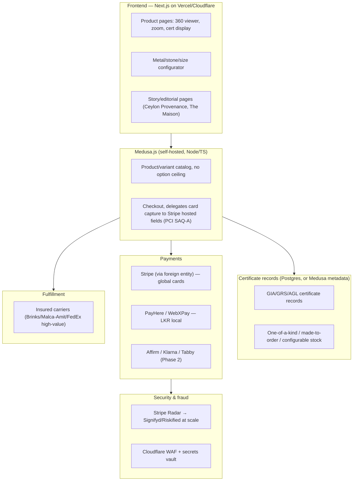

# Technical Architecture

## Commerce platform — Medusa.js (self-hosted), not Shopify Plus

**Revised 2026-08-05: client does not want to pay ongoing platform/license fees.** Shopify Plus was the original recommendation for speed-to-market, but it carries a real recurring cost (historically $2,300+/month base) plus per-transaction fees — and worse for this specific business, **Shopify Payments isn't available to Sri Lanka-domiciled merchants either**, so a Shopify store here would need a third-party gateway *and* eat Shopify's extra "external gateway" transaction surcharge on top of the base fee. That combination makes Shopify a weak fit once cost is the deciding factor, not just a preference.

**New primary recommendation: Medusa.js** — open-source, Node/TypeScript, self-hosted. No license fee; the only recurring cost is hosting (a small VPS/Postgres/Redis setup, roughly $20–100/month depending on scale, vs. Shopify Plus's few-thousand-dollar floor). It also happens to fit what's already built: the [storefront prototype](../storefront/) is plain Next.js with no Shopify SDK dependency yet, and Medusa ships an official Next.js storefront starter that's architecturally close to it — this is a clean swap, not a rebuild. Medusa also has no variant-count ceiling, which removes the metal × stone × size configurability workaround that Shopify would have required.

**The real trade-off, stated plainly:** Shopify Plus's fee buys you uptime, security patching, and PCI-adjacent infrastructure handled by someone else. Self-hosting Medusa means *you* (or a developer you hire) own server uptime, database backups, and applying updates. This isn't a technical downside so much as a "pay in money vs. pay in engineering time/attention" decision — worth being honest with the client about before committing, especially if there's no in-house ops capacity. A middle path exists: managed hosting for Medusa (e.g., a PaaS like Railway/Render, or Medusa's own cloud offering) trades some of that ops burden back for a smaller recurring fee than Shopify Plus.

**commercetools** or **Saleor** remain the right move only once the business genuinely outgrows Medusa's guardrails — both need a real in-house engineering team, 6–12+ month build timelines, and six-figure annual run-rates, so they're not a day-one choice regardless of the Shopify decision. Salesforce Commerce Cloud is cost-prohibitive pre-scale. BigCommerce Enterprise doesn't solve the core objection here — it's still a paid SaaS platform, just cheaper than Shopify Plus.

## Frontend

**Next.js (App Router)** is the standard top agencies use for luxury DTC: SSR for SEO-critical product/collection pages, ISR for catalog pages, streaming/RSC for perceived speed under heavy imagery. Pair with **Cloudinary or imgix** via a custom `next/image` loader rather than relying solely on Shopify's CDN — this buys on-the-fly art direction, AVIF/WebP negotiation, and a real DAM for ongoing collection photography.

Performance discipline for Core Web Vitals given how image-heavy this category is: lower quality (q50–65) on grid thumbnails, higher (q75–90) on hero/zoom images, preload the LCP hero image, defer 360°/3D viewer scripts until interaction. Host on Vercel (native Next.js fit) or Cloudflare/AWS if data residency becomes a concern at scale.

## Payments & checkout — Sri Lanka + global

This is the hardest architectural problem in the whole build. **Stripe, Adyen, and PayPal/Braintree do not onboard Sri Lanka-domiciled merchant entities directly** — Sri Lanka isn't on their supported-country lists. The standard, well-trodden workaround used by Sri Lankan exporters generally: incorporate a holding/subsidiary entity in a supported jurisdiction (a US LLC via Stripe Atlas, a UK Ltd, Singapore, or a UAE free zone) to hold the international merchant account, while the Sri Lankan entity continues to handle manufacturing and fulfillment. This is routine, not a workaround to be nervous about — but it is a real legal/accounting step that needs a lawyer and accountant, not just a dev team.

- **Global rail**: Stripe (via the foreign entity) — Radar for fraud, hosted Checkout/Elements to keep PCI scope at SAQ-A, multi-currency settlement.
- **Local rail**: **PayHere** or **WebXPay** (both CBSL-approved; WebXPay has the larger merchant base) for LKR/local-card traffic, kept as a separate checkout path rather than forced through the foreign entity.
- **Multi-currency pricing**: price natively in USD/EUR/GBP/AED with market-based (not pure PPP) localization — luxury brands deliberately price higher in strong markets rather than doing a flat FX conversion. With Medusa this is modeled directly (it supports multi-region/multi-currency pricing natively); with a Shopify-based approach it would have needed Shopify Markets specifically.
- **Financing** (Phase 2, not MVP): Affirm for US/Canada, Klarna for broader reach, Tabby/Tamara for a later Gulf expansion (both already serve gold/jewellery merchants in Saudi/UAE).
- **PCI**: hosted fields/redirect checkout everywhere so raw card data never touches your servers — keeps you at SAQ-A, essential with no in-house payments-compliance team.

## Security & fraud

Start with **Stripe Radar**; add **Signifyd** or **Riskified** once volume justifies their ~0.5–1.5% GMV fee — both provide chargeback-liability guarantees, which matters when a single fraudulent order can be $5,000–$50,000. Enforce 3D Secure/SCA on high-risk transactions beyond just the EU-mandated cases, given the ticket size. Baseline platform security: Cloudflare WAF at the edge, secrets in a managed vault (AWS Secrets Manager/Vault) with rotation, tighter rate limits on auth/checkout endpoints, encryption in transit and at rest.

For fulfillment: shipments above roughly $25,000–50,000 need specialist insured carriers (Brinks, Malca-Amit) or FedEx/UPS with declared-value coverage and mandatory signature — standard carrier liability caps (UPS caps precious-metal/gem loss at $1,000 regardless of declared value) make this non-negotiable rather than a nice-to-have.

## Inventory / PIM for fine jewellery

Generic PIMs and flat-variant commerce models don't fit fine jewellery well. Model each piece as a parent design plus component assets (mounting, center stone, side stones), each with independent attributes (metal purity, carat, clarity, certificate number) rather than flat SKUs. Explicitly distinguish three product types:

- **One-of-a-kind** — single inventory unit, delisted immediately on sale.
- **Made-to-order** — lead time shown, no stock decrement.
- **Configurable** — metal/stone/size matrix with per-combination stock (this is where the configurator UI earns its keep).

Attach the actual GIA/GRS/AGL certificate to the specific serialized unit — critical for one-of-a-kind pieces where the cert *is* the product page's core trust signal. Medusa's product/variant model plus its custom-metadata fields can carry this directly (no 3-option/100-variant ceiling to design around, unlike Shopify) — a lightweight companion Postgres table for certificate records is still reasonable at launch, but there's no structural need to route around platform limits the way the Shopify-based plan required.

## Provenance tech — adopt selectively, don't build bespoke

Not worth building a custom blockchain now. De Beers' Tracr (now partly GIA-owned and moving toward an independent industry platform) is becoming the de facto diamond-provenance ledger — plug into it later for sourced-stone provenance rather than reinventing it. For house-branded Ceylon pieces, a simple **NFC tag + serial lookup page** linking to the lab certificate and care record delivers most of the customer-trust value at a fraction of the infrastructure cost. This is a Phase 3 item (see [roadmap](04-roadmap.md)) — revisit full "provenance passport" tech once scale and brand prestige justify it as a marketing differentiator in its own right.

## Architecture at a glance

